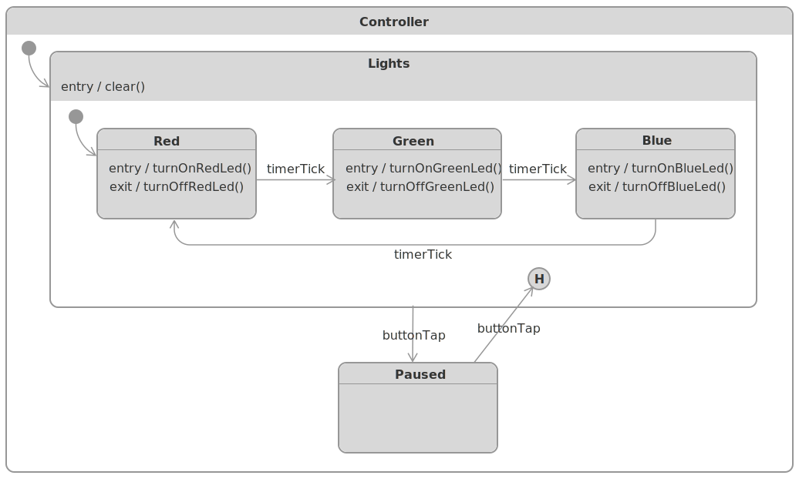

# HSMRunningLightsDemo 

This package contains an Xcode project with an iOS _HSMRunningLightsDemo_ app that demonstrates using [UML hierarchical state machine framework for Swift](https://github.com/SerhiyButz/HSM).

Here's the app controller's statechart:

